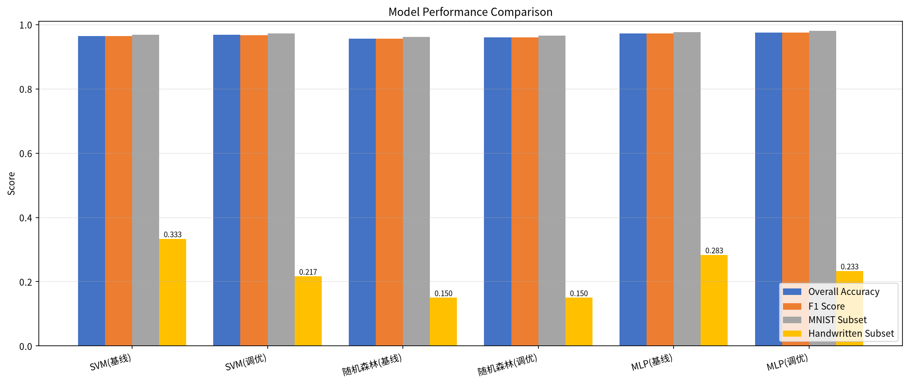
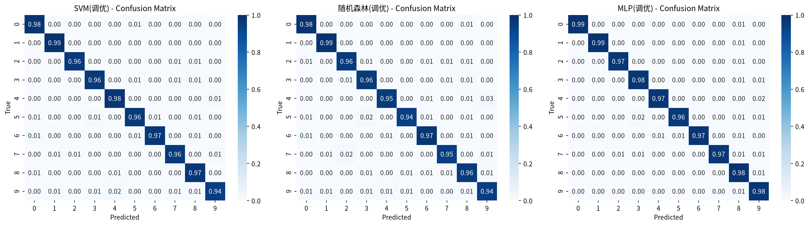

# 手写数字识别——基于多模型对比的机器学习实验

[](https://www.python.org/)
[](https://scikit-learn.org/)
[](LICENSE)

> 使用 SVM、随机森林、MLP 三种模型对手写数字（MNIST + 手工采集数据）进行训练与对比，结合数据增强与网格搜索调优。

---

## 📖 项目简介

本项目是机器学习课程的实践大作业，围绕手写数字识别这一经典任务展开。通过加载 MNIST 公开数据集、手工采集真实手写数据、实现数据增强流水线，分别构建 **支持向量机（SVM）**、**随机森林（Random Forest）**、**多层感知机（MLP）** 三种模型进行训练和预测，使用网格搜索进行参数调优，并在标准测试集和手工数据集上对比分析各模型性能。

### 关键特性

- 🧠 三种经典 ML 模型（SVM / 随机森林 / MLP）的完整对比实验
- 🔄 数据增强：旋转、平移、缩放、加噪声，扩充训练数据
- ✍️ 手工采集 60 张真实手写数字作为额外测试集
- 🔧 网格搜索（GridSearchCV）对各模型进行超参数调优
- 📊 丰富的可视化：混淆矩阵、模型性能对比、特征重要性、错误分析

---

## 📁 项目结构

```
├── main.ipynb                  # 主实验 Notebook（数据加载 → 训练 → 调优 → 评估）
├── preprocess_augment.py       # 手工数据预处理 & 增强脚本
├── 大作业报告.md                # 完整实验报告
├── README_zh.md                # 项目说明（本文件）
├── .gitignore
│
├── 手写数据_处理后/             # 处理后手工数据（28×28 PNG，MNIST 格式）
│   ├── 01_原始处理后/          # 60 张原始处理后图片
│   ├── 02_旋转增强/            # 旋转增强样本
│   ├── 03_平移增强/            # 平移增强样本
│   ├── 04_缩放增强/            # 缩放增强样本
│   └── 05_噪声增强/            # 噪声增强样本
│
└── *.png                       # Notebook 生成的各类可视化图表
    ├── 增强效果展示.png
    ├── 手工数据展示.png
    ├── 模型性能对比.png
    ├── 混淆矩阵对比.png
    ├── 手写数据错误分析.png
    └── 特征重要性.png
```

---

## 🚀 快速开始

### 环境要求

- Python 3.10+
- 主要依赖：`numpy`, `pandas`, `matplotlib`, `seaborn`, `scikit-learn`, `scipy`, `Pillow`

### 安装

```bash
pip install numpy pandas matplotlib seaborn scikit-learn scipy Pillow jupyter
```

### 运行

**1. 手工数据预处理（可选——处理后数据已包含在仓库中）**

```bash
python preprocess_augment.py
```

该脚本将 `手写数据_原图/` 中的 3456×3456 照片处理为 28×28 MNIST 格式，并做旋转、平移、缩放、噪声增强。

**2. 打开主实验 Notebook**

```bash
jupyter notebook main.ipynb
```

按顺序执行所有单元格即可复现完整实验。

---

## 📊 数据集

| 数据集 | 数量 | 说明 |
|-------|------|------|
| MNIST 训练集 | 60,000 | 公开数据集，前 60K 张 |
| MNIST 测试集 | 10,000 | 公开数据集，后 10K 张 |
| 训练增强数据 | 25,000 | 从训练集抽样后旋转/平移/加噪声 |
| 手工采集数据 | 60 | 纸笔手写 + 手机拍摄，0-9 各 6 张 |

**数据划分策略：**
- MNIST 60K → 80% 训练 (48K) + 20% 验证 (12K)
- 训练集 = 48K 原始 + 25K 增强 = 73K
- 测试集 = 10K MNIST + 60 手工

---

## 🧪 实验结果

### 测试集表现（MNIST 10K + 手工 60）

| 模型 | 准确率 | 精确率 | 召回率 | F1 | MNIST子集 | 手工子集 |
|------|--------|--------|--------|-----|-----------|----------|
| **MLP (调优)** | **0.9756** | **0.9760** | **0.9754** | **0.9756** | 0.9801 | 0.2333 |
| MLP (基线) | 0.9721 | 0.9724 | 0.9717 | 0.9720 | 0.9762 | 0.2833 |
| SVM (调优) | 0.9676 | 0.9675 | 0.9673 | 0.9673 | 0.9721 | 0.2167 |
| SVM (基线) | 0.9642 | 0.9640 | 0.9638 | 0.9639 | 0.9680 | 0.3333 |
| 随机森林 (调优) | 0.9600 | 0.9598 | 0.9596 | 0.9597 | 0.9649 | 0.1500 |
| 随机森林 (基线) | 0.9565 | 0.9565 | 0.9561 | 0.9562 | 0.9613 | 0.1500 |

### 模型性能对比



### 混淆矩阵



---

## 🔑 关键结论

1. **MLP 表现最优**：采用三层隐藏层 (256, 128, 64) 的 MLP 在 MNIST 测试集上达到 98.01% 准确率，显著优于 SVM 和随机森林。
2. **数据增强有效**：增强后的训练数据使 SVM 验证集准确率从 0.9668 提升到 0.9692。
3. **手工数据挑战**：所有模型在手工采集数据上表现不佳（最高仅 33.33%），说明手机拍摄的真实手写图片与 MNIST 标准数据集存在分布差异，需要更丰富的预处理策略。
4. **随机森林最快**：随机森林训练仅需 ~7s，推理 <0.3s，适合对速度要求高的场景。

---

## 📝 技术细节

### 预处理流程

```
原图 (3456×3456 RGB)
  → 灰度化 → 缩放至 28×28 → 自动判断背景色并反色
  → Min-Max 归一化 → Gamma 增强 (γ=0.9)
```

### 数据增强

- **旋转**：±15° 随机旋转
- **平移**：±3 像素随机平移
- **缩放**：0.9~1.1 倍随机缩放
- **噪声**：高斯噪声 + 椒盐噪声混合

### 模型参数

| 模型 | 最佳参数（网格搜索） |
|------|------|
| SVM | `C=10, gamma=0.01, kernel='rbf'` |
| 随机森林 | `n_estimators=200, max_depth=None` |
| MLP | `hidden_layer_sizes=(256,128,64), learning_rate_init=0.001` |

---

## 📄 License

MIT License.

---

## 🙏 致谢

- MNIST 数据集由 Yann LeCun 等人提供
- 实验基于 scikit-learn 机器学习框架
